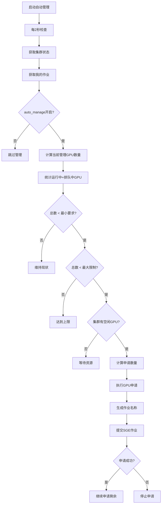

# GPU 管理器完整使用指南

## 📋 目录

- [概述](#概述)
- [核心架构](#核心架构)
- [GPU 获取策略详解](#gpu获取策略详解)
- [配置参数说明](#配置参数说明)
- [运行模式详解](#运行模式详解)
- [智能决策算法](#智能决策算法)
- [使用指南](#使用指南)
- [故障排除](#故障排除)
- [性能优化](#性能优化)

---

## 🎯 概述

综合 GPU 资源管理器是一个为 Notre Dame CRC 环境设计的智能化 GPU 资源管理工具。它集成了 GPU 资源监控、自动申请释放、系统资源监控和作业状态跟踪等功能，提供一站式的 GPU 计算资源管理解决方案。

### 主要特性

- **🤖 智能自动管理**: 基于配置策略自动申请和维护 GPU 资源
- **📊 实时监控**: 实时显示集群状态、作业信息和系统资源
- **🎛️ 灵活配置**: 支持多种运行模式和策略参数
- **🛡️ 容错机制**: 完善的错误处理和恢复机制
- **📈 详细信息**: 提供作业队列位置、资源请求等详细信息

---

## 🏗️ 核心架构

### 3 层架构设计

```
┌─────────────────────┐
│  ComprehensiveGPUManager  │  ← 主控制器
├─────────────────────┤
│  GPUMonitor         │  ← 监控层
│  SystemMonitor      │  ← 系统监控层
│  GPUJobManager      │  ← 管理层
│  StatusDisplay      │  ← 显示层
└─────────────────────┘
```

#### **监控层 (GPUMonitor)**

- **职责**: 收集 GPU 节点状态和作业信息
- **数据源**: `free_gpus.sh`、`qstat -u user -xml`
- **功能**:
  - 获取集群 GPU 节点状态
  - 解析用户 GPU 作业详情
  - 计算队列位置和资源请求

#### **管理层 (GPUJobManager)**

- **职责**: 执行 GPU 申请和释放操作
- **操作**: `qsub`、`qdel`
- **功能**:
  - 单个 GPU 申请
  - 批量 GPU 申请
  - 作业释放管理

#### **系统监控层 (SystemMonitor)**

- **职责**: 收集系统资源状态
- **数据源**: `/proc/stat`、`free`、`df`、`/proc/loadavg`
- **功能**:
  - CPU 使用率监控
  - 内存使用率监控
  - 磁盘空间监控
  - 系统负载监控

#### **显示层 (ComprehensiveStatusDisplay)**

- **职责**: 格式化和展示状态信息
- **功能**:
  - 横向布局优化
  - 实时状态更新
  - 详细作业信息展示

---

## 🎮 GPU 获取策略详解

### 自动管理决策流程



### 作业识别策略

程序通过以下方式识别和管理 GPU 作业：

#### **1. 作业名称前缀识别**

```python
job_prefix = "NDFS_"  # 默认前缀
managed_jobs = [job for job in jobs if job.task_name.startswith(job_prefix)]
```

#### **2. GPU 作业检测**

```python
# 方法1: 运行中作业通过队列名检测
if queue_name and "gpu@" in queue_name:
    is_gpu_job = True

# 方法2: 排队作业通过资源请求检测
if "gpu_card" in hard_resource_list:
    is_gpu_job = True
```

#### **3. 资源数量解析**

```python
# GPU数量: 从resource_requests解析
resource_requests = self._get_job_resources(job_id)
gpu_count = int(resource_requests["gpu_card"]) if "gpu_card" in resource_requests else 1

# CPU数量: 从slots字段获取
cpu_count = int(slots_text) if slots_text.isdigit() else 1
```

### 申请数量计算算法

```python
def calculate_needed_gpus(current_managed, min_required, max_total):
    """
    计算需要申请的GPU数量

    Args:
        current_managed: 当前管理的GPU总数 (运行中+排队中)
        min_required: 最小保留GPU数量
        max_total: 最大GPU总数限制

    Returns:
        needed: 需要申请的GPU数量
    """
    if current_managed >= min_required:
        return 0  # 已满足最小要求

    gap_to_min = min_required - current_managed
    gap_to_max = max_total - current_managed

    needed = min(gap_to_min, gap_to_max)
    return max(0, needed)
```

---

## ⚙️ 配置参数说明

### 默认配置 (`gpu_manager_config_simplified.json`)

```json
{
  "monitor_interval": 2, // 监控间隔时间(秒)
  "min_reserved_gpus": 1, // 最小保留GPU数量
  "max_reserved_gpus": 2, // 最大保留GPU数量(当前未使用)
  "max_total_gpus": 4, // 最大总GPU数量限制
  "job_prefix": "NDFS_", // 管理作业名称前缀
  "auto_manage": true // 自动管理开关
}
```

### 参数详细说明

| 参数                | 类型 | 默认值   | 说明                                      |
| ------------------- | ---- | -------- | ----------------------------------------- |
| `monitor_interval`  | int  | 2        | 状态检查间隔(秒)，建议 1-5 秒             |
| `min_reserved_gpus` | int  | 1        | 最少保持的 GPU 数量，低于此值会自动申请   |
| `max_reserved_gpus` | int  | 2        | 最大保留数量(未实现)，预留给未来扩展      |
| `max_total_gpus`    | int  | 4        | 绝对最大 GPU 数量，防止过度申请           |
| `job_prefix`        | str  | "NDFS\_" | 管理作业的前缀标识，用于区分自动/手动作业 |
| `auto_manage`       | bool | true     | 自动管理开关，false 时仅监控不申请        |

### 配置优化建议

#### **轻量级配置** (单用户，偶尔使用)

```json
{
  "monitor_interval": 5,
  "min_reserved_gpus": 1,
  "max_total_gpus": 2,
  "auto_manage": true
}
```

#### **积极配置** (团队使用，频繁计算)

```json
{
  "monitor_interval": 1,
  "min_reserved_gpus": 2,
  "max_total_gpus": 8,
  "auto_manage": true
}
```

#### **保守配置** (资源紧张环境)

```json
{
  "monitor_interval": 10,
  "min_reserved_gpus": 1,
  "max_total_gpus": 2,
  "auto_manage": false
}
```

---

## 🎛️ 运行模式详解

### 1. 监控模式 (默认)

```bash
python scripts/gpu_manager.py
# 或
python scripts/gpu_manager.py --monitor
```

**特点**:

- 仅监控状态，不执行自动申请
- 实时显示集群和作业信息
- 适合状态观察和调试

**输出示例**:

```
================================================================================
🖥️  综合GPU资源管理器 - 2025-07-22 02:30:00
👤 用户: zchen27
================================================================================

📊 集群状态                        💻 系统资源
   总GPU数: 44                     CPU使用率: 7.3%
   空闲GPU: 0                      内存使用率: 65.8%
   GPU使用率: 100.0%           磁盘使用率: 21.0%
   我的运行CPU: 25              系统负载: 3.92
   我的排队CPU: 0               运行时间: 44:24:47
                                           进程数: 1452
```

### 2. 自动管理模式

```bash
python scripts/gpu_manager.py --manage
```

**特点**:

- 启用自动 GPU 申请和释放
- 根据配置策略智能决策
- 适合长期运行和无人值守

**决策逻辑**:

```python
while running:
    current_gpus = count_managed_gpus()
    cluster_free = count_free_gpus()

    if current_gpus < min_required and cluster_free > 0:
        needed = min(min_required - current_gpus, max_total - current_gpus)
        for i in range(needed):
            request_gpu(f"auto_{i+1}")
```

### 3. 手动操作模式

#### **申请指定数量 GPU**

```bash
python scripts/gpu_manager.py --request 3
```

#### **释放指定作业**

```bash
python scripts/gpu_manager.py --release 1911586
```

#### **单次状态查看**

```bash
python scripts/gpu_manager.py --status
```

### 4. Tmux 会话管理

#### **创建后台管理会话**

```bash
# 创建自动管理会话
tmux new-session -d -s gpu_manager 'python scripts/gpu_manager.py --manage'

# 进入会话查看
tmux attach -t gpu_manager

# 分离会话 (Ctrl+B, D)
# 终止会话
tmux kill-session -t gpu_manager
```

---

## 🧠 智能决策算法

### 状态评估算法

```python
def evaluate_gpu_status(self, jobs: List[GPUJob]) -> dict:
    """评估当前GPU状态并生成决策建议"""

    # 分类统计管理的作业
    managed_jobs = [job for job in jobs if job.task_name.startswith(self.job_prefix)]

    running_jobs = [job for job in managed_jobs if job.status == "running"]
    pending_jobs = [job for job in managed_jobs if job.status == "pending"]

    running_gpus = sum(job.gpu_count for job in running_jobs)
    pending_gpus = sum(job.gpu_count for job in pending_jobs)
    total_managed = running_gpus + pending_gpus

    # 生成状态评估
    status = {
        'total_managed': total_managed,
        'running_gpus': running_gpus,
        'pending_gpus': pending_gpus,
        'below_minimum': total_managed < self.config['min_reserved_gpus'],
        'at_maximum': total_managed >= self.config['max_total_gpus'],
        'recommendation': self._generate_recommendation(total_managed)
    }

    return status

def _generate_recommendation(self, current: int) -> str:
    """生成操作建议"""
    min_req = self.config['min_reserved_gpus']
    max_total = self.config['max_total_gpus']

    if current < min_req:
        needed = min(min_req - current, max_total - current)
        return f"建议申请 {needed} 个GPU以满足最小要求"
    elif current > max_total:
        excess = current - max_total
        return f"超出限制 {excess} 个GPU，建议释放部分作业"
    else:
        return "GPU资源配置合理，维持现状"
```

### 智能申请策略

#### **时间窗口控制**

```python
def should_request_now(self) -> bool:
    """判断是否适合现在申请GPU"""

    # 避免在集群维护时间申请
    current_hour = datetime.now().hour
    if 2 <= current_hour <= 6:  # 凌晨2-6点维护时间
        return False

    # 检查最近申请频率
    if self.last_request_time:
        elapsed = time.time() - self.last_request_time
        if elapsed < 60:  # 1分钟内不重复申请
            return False

    return True
```

#### **动态优先级调整**

```python
def calculate_request_priority(self, current_load: float) -> int:
    """根据系统负载计算申请优先级"""

    if current_load < 0.5:
        return 1  # 高优先级，系统空闲
    elif current_load < 1.0:
        return 2  # 中优先级，适度负载
    else:
        return 3  # 低优先级，系统繁忙
```

---

## 📚 使用指南

### 快速开始

#### **1. 基础监控**

```bash
# 进入项目目录
cd /users/zchen27/ND-Flexible-Sensor

# 查看当前状态
python scripts/gpu_manager.py --status

# 启动实时监控
python scripts/gpu_manager.py
```

#### **2. 启用自动管理**

```bash
# 前台运行自动管理
python scripts/gpu_manager.py --manage

# 后台运行自动管理
tmux new-session -d -s gpu_manager 'python scripts/gpu_manager.py --manage'
```

#### **3. 手动操作**

```bash
# 申请2个GPU
python scripts/gpu_manager.py --request 2

# 释放作业1911586
python scripts/gpu_manager.py --release 1911586

# 查看帮助
python scripts/gpu_manager.py --help
```

### 配置定制

#### **创建自定义配置**

```bash
# 复制默认配置
cp gpu_manager_config_simplified.json my_config.json

# 编辑配置
vim my_config.json

# 使用自定义配置
python scripts/gpu_manager.py --config my_config.json --manage
```

#### **配置示例场景**

**科研计算场景**:

```json
{
  "monitor_interval": 3,
  "min_reserved_gpus": 2,
  "max_total_gpus": 6,
  "job_prefix": "RESEARCH_",
  "auto_manage": true
}
```

**开发测试场景**:

```json
{
  "monitor_interval": 5,
  "min_reserved_gpus": 1,
  "max_total_gpus": 2,
  "job_prefix": "DEV_",
  "auto_manage": false
}
```

### 集成到工作流

#### **与研究脚本集成**

```python
#!/usr/bin/env python3
"""研究脚本示例"""

import subprocess
import time

def ensure_gpu_available():
    """确保有GPU可用"""
    result = subprocess.run([
        "python", "scripts/gpu_manager.py", "--status"
    ], capture_output=True, text=True)

    if "运行中GPU: 0" in result.stdout:
        print("申请GPU资源...")
        subprocess.run([
            "python", "scripts/gpu_manager.py", "--request", "1"
        ])
        time.sleep(30)  # 等待GPU就绪

def main():
    ensure_gpu_available()
    # 运行GPU计算任务
    run_gpu_computation()

if __name__ == "__main__":
    main()
```

#### **批处理脚本集成**

```bash
#!/bin/bash
# batch_job.sh

# 确保GPU管理器运行
tmux has-session -t gpu_manager 2>/dev/null || \
tmux new-session -d -s gpu_manager 'python scripts/gpu_manager.py --manage'

# 等待GPU就绪
echo "等待GPU资源..."
while [ $(python scripts/gpu_manager.py --status | grep "运行中GPU" | cut -d: -f2 | cut -d' ' -f2) -eq 0 ]; do
    sleep 10
done

echo "GPU就绪，开始计算任务..."
# 执行实际计算任务
python my_gpu_computation.py
```

---

## 🔧 故障排除

### 常见问题及解决方案

#### **1. GPU 申请失败**

**症状**: 显示"❌ 申请失败"
**可能原因**:

- 集群资源不足
- SGE 配置问题
- 网络连接问题

**解决方案**:

```bash
# 检查集群状态
free_gpus.sh @crc_gpu

# 检查SGE配置
qconf -sql
qconf -sq gpu

# 手动测试申请
qsub -q gpu -l gpu_card=1 -b y sleep 60
```

#### **2. 作业检测不到**

**症状**: 运行的 GPU 作业不显示在状态中
**可能原因**:

- 作业名称不包含管理前缀
- qstat 权限问题
- XML 解析错误

**解决方案**:

```bash
# 检查用户作业
qstat -u $USER

# 检查XML输出
qstat -u $USER -xml

# 检查作业详情
qstat -j <job_id>
```

#### **3. 配置文件问题**

**症状**: 程序使用默认配置而非自定义配置
**可能原因**:

- 配置文件路径错误
- JSON 格式错误
- 权限问题

**解决方案**:

```bash
# 验证JSON格式
python -m json.tool gpu_manager_config_simplified.json

# 检查文件权限
ls -la gpu_manager_config_simplified.json

# 使用绝对路径
python scripts/gpu_manager.py --config /full/path/to/config.json
```

#### **4. Tmux 会话问题**

**症状**: 无法创建或连接 tmux 会话
**可能原因**:

- 会话名冲突
- tmux 版本问题
- 终端环境问题

**解决方案**:

```bash
# 检查现有会话
tmux list-sessions

# 终止冲突会话
tmux kill-session -t gpu_manager

# 重新创建会话
tmux new-session -d -s gpu_manager_new 'python scripts/gpu_manager.py --manage'
```

### 调试技巧

#### **1. 详细日志模式**

```python
# 在脚本中添加调试信息
import logging
logging.basicConfig(level=logging.DEBUG)

# 或设置环境变量
export DEBUG=1
python scripts/gpu_manager.py --manage
```

#### **2. 分步调试**

```bash
# 逐步检查各组件
python -c "
from scripts.gpu_manager import GPUMonitor
monitor = GPUMonitor()
print('Nodes:', monitor.get_gpu_nodes())
print('Jobs:', monitor.get_my_jobs())
"
```

#### **3. 性能分析**

```bash
# 使用time命令分析执行时间
time python scripts/gpu_manager.py --status

# 使用strace跟踪系统调用
strace -c python scripts/gpu_manager.py --status
```

---

## 🚀 性能优化

### 监控性能优化

#### **1. 降低检查频率**

```json
{
  "monitor_interval": 5 // 从2秒增加到5秒
}
```

#### **2. 缓存机制**

```python
class CachedGPUMonitor(GPUMonitor):
    def __init__(self, cache_ttl=30):
        super().__init__()
        self.cache = {}
        self.cache_ttl = cache_ttl

    def get_gpu_nodes(self):
        now = time.time()
        if 'nodes' in self.cache:
            if now - self.cache['nodes']['timestamp'] < self.cache_ttl:
                return self.cache['nodes']['data']

        data = super().get_gpu_nodes()
        self.cache['nodes'] = {'data': data, 'timestamp': now}
        return data
```

#### **3. 异步处理**

```python
import asyncio
import concurrent.futures

class AsyncGPUManager:
    async def collect_all_status(self):
        with concurrent.futures.ThreadPoolExecutor() as executor:
            nodes_future = executor.submit(self.gpu_monitor.get_gpu_nodes)
            jobs_future = executor.submit(self.gpu_monitor.get_my_jobs)
            system_future = executor.submit(self.system_monitor.get_system_status)

            nodes = await asyncio.wrap_future(nodes_future)
            jobs = await asyncio.wrap_future(jobs_future)
            system_status = await asyncio.wrap_future(system_future)

            return nodes, jobs, system_status
```

### 资源使用优化

#### **1. 内存优化**

```python
# 使用__slots__减少内存占用
@dataclass
class GPUJob:
    __slots__ = ['job_id', 'task_name', 'gpu_count', 'cpu_count', 'status', 'node']
```

#### **2. CPU 优化**

```python
# 使用正则表达式编译
class GPUMonitor:
    def __init__(self):
        self.gpu_pattern = re.compile(r"Free GPU cards on (\S+) : (\d+)")
        self.job_pattern = re.compile(r"gpu_card=(\d+)")
```

#### **3. 网络优化**

```python
# 减少subprocess调用
def batch_qstat_calls(job_ids):
    """批量获取作业信息而非逐个查询"""
    if not job_ids:
        return {}

    cmd = ["qstat", "-j"] + job_ids
    result = subprocess.run(cmd, capture_output=True, text=True)
    return parse_batch_qstat_output(result.stdout)
```

### 扩展性优化

#### **1. 插件架构**

```python
class GPUManagerPlugin:
    def on_gpu_acquired(self, job_id: str):
        pass

    def on_gpu_released(self, job_id: str):
        pass

    def on_status_update(self, status: dict):
        pass

class NotificationPlugin(GPUManagerPlugin):
    def on_gpu_acquired(self, job_id: str):
        send_slack_notification(f"GPU acquired: {job_id}")
```

#### **2. 配置热重载**

```python
import watchdog.events
import watchdog.observers

class ConfigWatcher(watchdog.events.FileSystemEventHandler):
    def __init__(self, manager):
        self.manager = manager

    def on_modified(self, event):
        if event.src_path.endswith('.json'):
            self.manager.reload_config()
```

#### **3. 多用户支持**

```python
class MultiUserGPUManager:
    def __init__(self):
        self.user_managers = {}

    def get_manager_for_user(self, username):
        if username not in self.user_managers:
            config_file = f"config_{username}.json"
            self.user_managers[username] = ComprehensiveGPUManager(config_file)
        return self.user_managers[username]
```

---

## 📊 最佳实践

### 1. 配置策略

- **开发阶段**: `min_reserved_gpus: 1, max_total_gpus: 2, auto_manage: false`
- **实验阶段**: `min_reserved_gpus: 2, max_total_gpus: 4, auto_manage: true`
- **生产阶段**: `min_reserved_gpus: 1, max_total_gpus: 8, auto_manage: true`

### 2. 监控策略

- **实时任务**: `monitor_interval: 1-2`秒
- **常规任务**: `monitor_interval: 3-5`秒
- **后台任务**: `monitor_interval: 10-30`秒

### 3. 资源管理

- 定期清理过期作业
- 监控资源使用效率
- 根据需求动态调整配置

### 4. 故障预防

- 定期备份配置文件
- 监控系统日志
- 设置资源使用告警

---

## 📝 更新日志

### v2.0.0 (2025-07-22)

- ✅ 综合 GPU 管理器重构完成
- ✅ 修复 GPU/CPU 数量统计错误
- ✅ 优化界面布局，横向并排显示
- ✅ 移除网络接口显示，专注核心功能
- ✅ 增强作业信息显示，包含详细资源信息
- ✅ 完善错误处理和容错机制

### v1.0.0 (2025-07-21)

- ✅ 初版 GPU 资源管理器完成
- ✅ 实现基础监控和自动管理功能
- ✅ 中文化界面显示
- ✅ 支持多种运行模式

---

## 🔗 相关文档

- [development_record.md](development_record.md) - 开发记录和版本历史
- [objective.md](objective.md) - 项目目标和进展
- [gpu_manager_config_simplified.json](gpu_manager_config_simplified.json) - 默认配置文件

---

## 📞 支持与反馈

如有问题或建议，请联系开发团队或在项目仓库提交 Issue。

**最后更新**: 2025-07-22  
**文档版本**: v2.0.0
